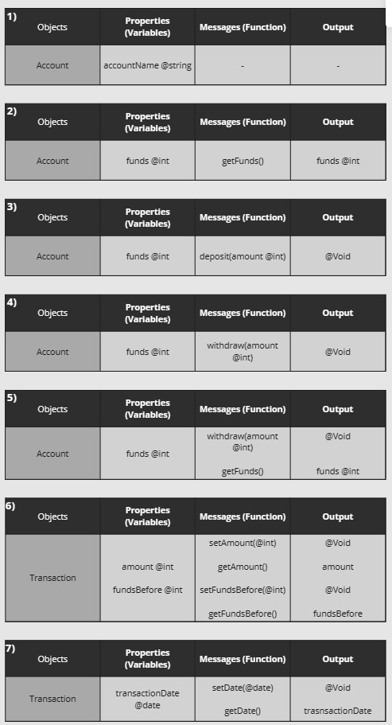
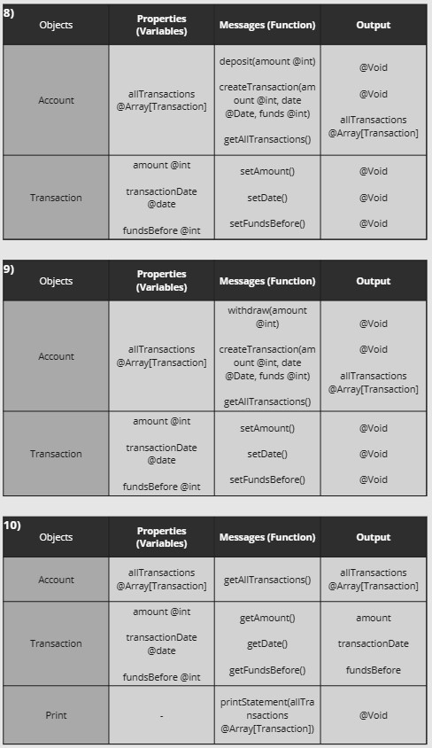
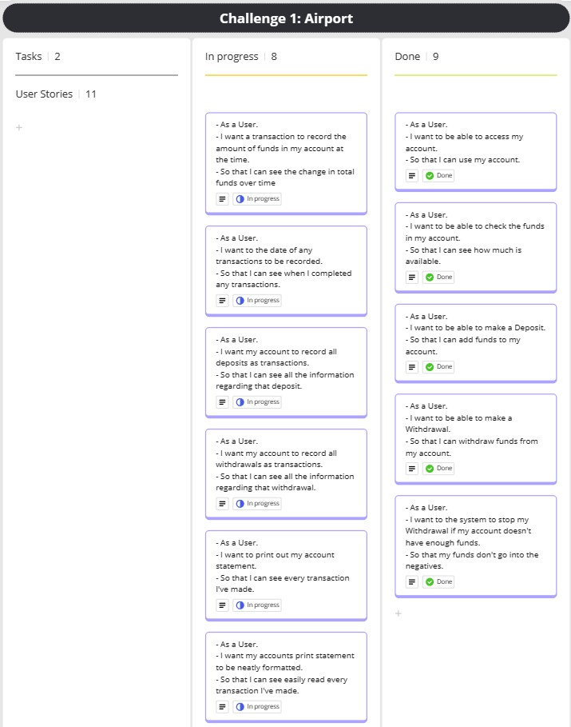
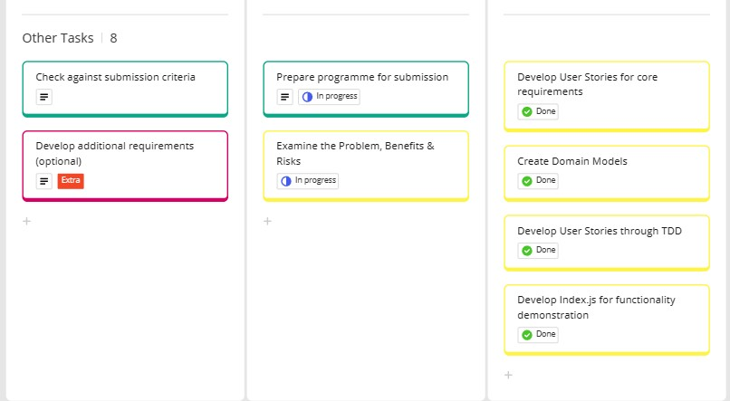

# Domain Models and Test Plan

## User Stories
User Stories derived from set of user requirements in documentation:

- **As a User** 
I want to be able to access my account.
 
So that I can use my account.

- **As a User** 
I want to be able to check the funds in my account.
 
So that I can see how much is available.

- **As a User** 
I want to be able to make a Deposit.
 
So that I can add funds to my account.

- **As a User** 
I want to be able to make a Withdrawal.
 
So that I can withdraw funds from my account.

- **As a User** 
I want to the system to stop my Withdrawal if my account doesn't have enough funds.
 
So that my funds don't go into the negatives.

- **As a User** 
I want a transaction to record the amount of funds in my account at the time.
 
So that I can see the change in total funds over time

- **As a User** 
I want to the date of any transactions to be recorded.
 
So that I can see when I completed any transactions.

- **As a User** 
I want my account to record all deposits as transactions.
 
So that I can see all the information regarding that deposit.

- **As a User** 
I want my account to record all withdrawals as transactions.
 
So that I can see all the information regarding that withdrawal.

- **As a User** 
I want to print out my account statement.
 
So that I can see every transaction I've made.

- **As a User** 
I want my accounts print statement to be neatly formatted.
 
So that I can see easily read every transaction I've made.

## Domain Models
Domain models created from User Stories, ordered to match up with corresponding story in above list:

## Kanban Board
Screenshots of the Kanban board I used to structure the development process:

  
##### Development by Connor Boscherini